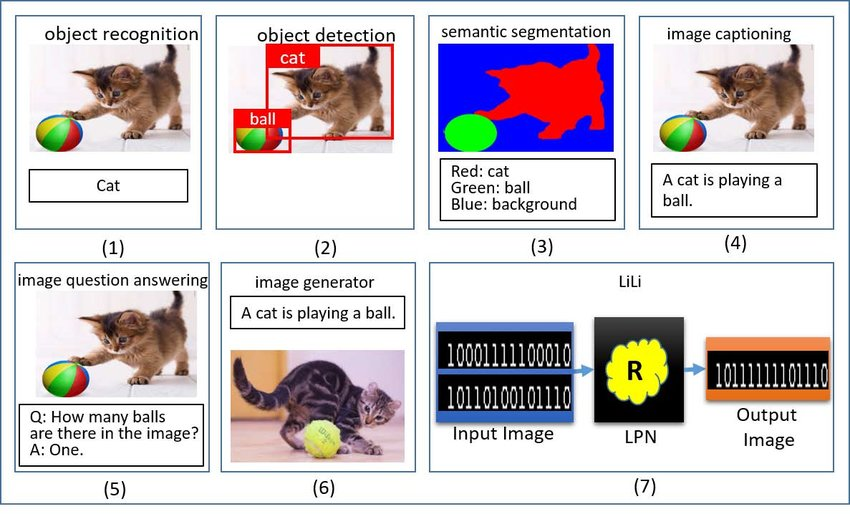

# Computer Vision 

## Object Recognition vs. Object Detection 
Though both are closely similar to each other, being a significant component in computer vision, there are still differences between the two, more specficilly on how they function and be used.

### Object Recognition
- Identifies the specificobject present in the frame / image
- It is similar to making the machine understand / recognize what is present in the image.
- It can only idenitfy or recognize a single object in the image on where the model is trained on.
- Thus, the limitation of object recognition is that it can only recognize a single object in the image.

### Object Detection
- Identifies the object present in the frame / image at the same time locates where it is in the frame / image.
- It is a combination of image classification and object localization.
- It also resolves the limitation of object recognition by being able to detect multiple objects in the image at the same time, localizing and identifying them.

### Image Classification
- Identifies / Classifies the whole image as a whole.
- It is a process of assigning a label to an image from a fixed set of categories.
- Compared to object recognition, image classification can only identify the whole image as a whole, not the specific object in the image.

### Object Localization
- It is an algorithm that identifies the location of an object in an image.
- It identifies an object in an image through layering a bounding box around the object. 
- This typically involves the matrix value of the center point of the bounding box coordinate and the width and height of the bounding box.
