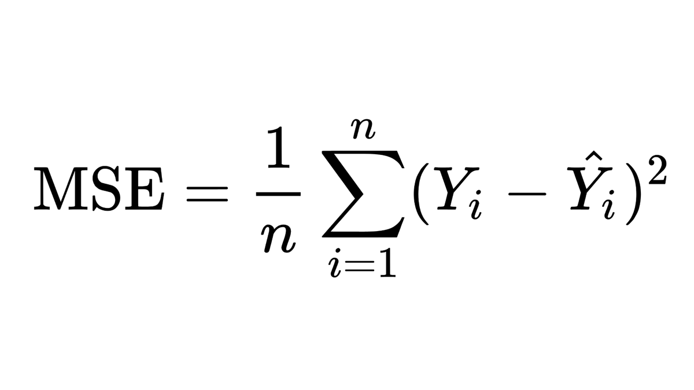
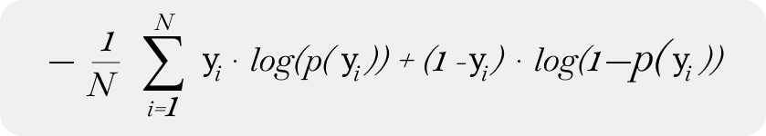
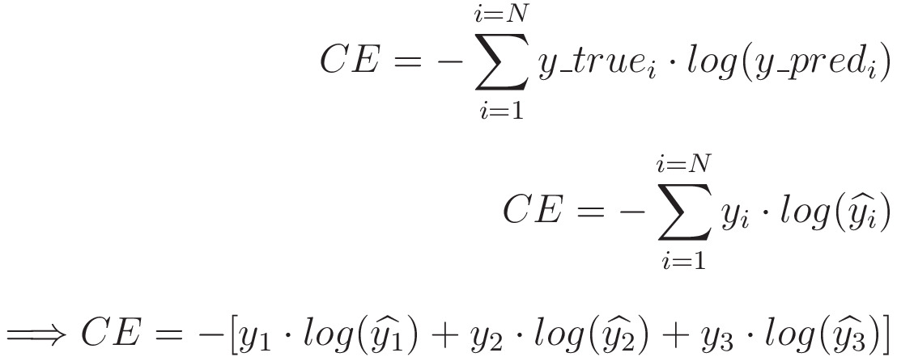

# Data Science 

## Loss Functions / Cost Functions 
- The measure of how well a model is performing with respect to its input. 
- During Machine learning training, the goal is to minimize the loss function. 
- This is similar to measuring the margin of error between the predicted value and the actual value.
### Types:
1. Mean Squared Error (MSE)
   - The average squared difference between the estimated values and the actual value.
    - This is commonly used in regression tasks.
    - Formula:
    - 
2. Binary Cross Entropy (Log Loss)
   -   Used in binary classification tasks (involving classification of just two classes).
   -   measures the performance of a classification model whose output is a probability value between 0 and 1.
   -   Formula:
   -   
3. Categorical Cross Entropy
   - Used in multi-class classification tasks.
   - measures the performance of a classification model whose output is a distributed among all the given classes (more than 2).
   - Formula:
   - 
4. Hinge Loss
   - Used in support vector machines (SVMs)
   - Used in classification models, more particular in maximum margin classification.

