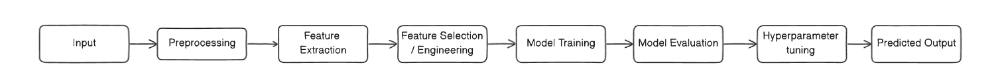

# Machine Learning 
- A subset of Artificial Intelligence (AI)
- It is the development of algorithms and statistical models that aims to estimate the relationship between the input and output variables.
- It is the process of teaching a computer to learn from data and make decisions accordingly. 
## End-to-End Learning 
- A deep learning process
- This aims to simplify the traditional machine learning pipeline by integrating all the common steps (feature extraction, data validation, text analysis, cleaning, etc.) in machine learning into a single model.
- This takes on large amounts of raw data and automatically learns from it without the need for human intervention.
- The drawbacks to this approach is that it requires a large amount of data and computational power to train the model. If the dataset is not enough to be able to completely train the model, it is best to result into diving the process into smaller steps then training them individually.

> This is an example of a traditional object recognition pipeline. 
> When it comes to end-to-end, it would only take a single abstracted model, and input and output layer. This removes all of the other steps in the pipeline and automates its process into a single model. 

## Incremental Learning 
- Also known as `online learning`
- A machine learning method where the model is trained on new data over time.
- It is where the model continouously / progressively learns without forgetting previously acquired information.
- This is in contrast to traditional batch learning where the model is trained in a single session and is not updated.
- Making the model capable of training continuously

### Catastrophic Forgetting
- A common problem in incremental learning 
- This is when the model forgets the previously / old acquired knolwedge when it learns new information.
- This is when training using back propagation and standard cross-entropy loss with only the new classes training data, the model can forget its learned knowledge on the old classes

## Meta Learning
- Also known as `learning to learn`
- Making it possible to create deep neural networks with a small amount of data

## Linear Regression
- tries to fit a linear curve or line based on the distribution of the vector data in the graph.
- used for forecasting tasks where you aim to predict the future values based on the distribution of past datas.
- the requirement for it to be used as the right model is that the data must be [parametric](../data-analytics/ReadME.md). 

## Logistic Regression
- closely similar to linear regression but more specialized for classification tasks.
- Instead of fitting a straight line in the scattered data, logistic fits an "S" curve, ranging from 0 to 1. 
- 0 values corresponds to negative values of X while 1 values corresponds to positive values of X.
- similar to linear regression, the data must also be [parametric](../data-analytics/ReadME.md) 

## Cost Function / Loss Function 
- measures the performance of a machine learning model for given data. On how well the model maps out the relationship between the input and output.
- in machine learning, your goal is to attain and minimize the value of the cost function

## Recurrent Neural Network 
- the processed output by a model will be appended to the next input to the same model (meaning that the data is in continuous loop)

### Long term dependency problem
- the increase in steps in the model, the information piles up, hence making the model not effective in learning new inputs 

## Long Short Term Memory
- Solution for long term dependency problem 
- LSTM carefully picks necessary inputs based on the context and outputs the information. This forgets other unncessary information reoccuring in the RNN. 
- adds an internal state in the RNN called LSTM cell state.
- The LSTM cell, the node that is working on the LSTM cell state, is composed of 3 gates (Forget gate, Input gate, and Output gate)
    - `Forget gates` pass through information that are not necessary based on the context 
    - `Input gates` pass through information that is useful for the RNN towards the internal state
    - `Output gates` outputs all the necessary / filtered information processed by the LSTM cell

